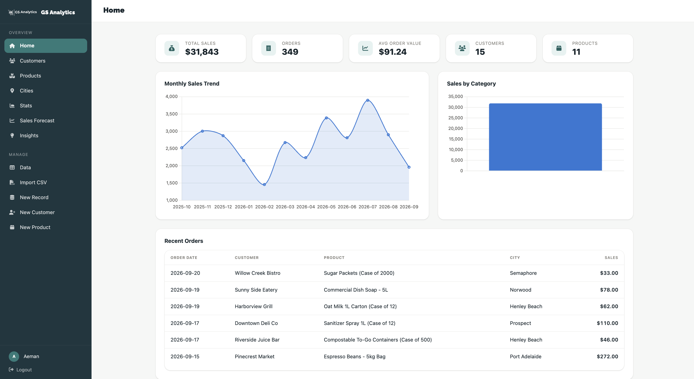
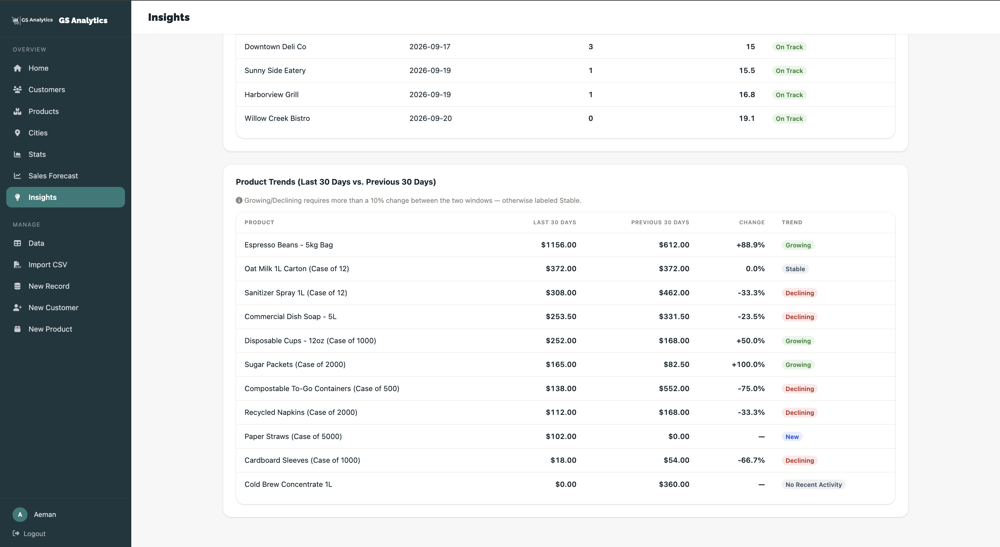
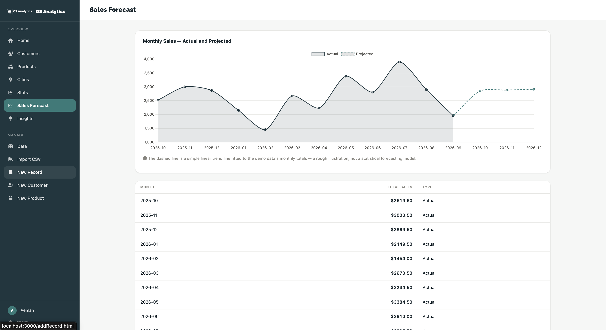

# GS Analytics

Small-business sales intelligence without enterprise BI complexity.

GS Analytics is a multi-tenant web application for tracking customers, products and sales. It provides clear dashboards, searchable drill-down views and explainable insights designed for a business owner—not a data analyst.

It is **not intended to compete with Power BI** and does not present simple arithmetic as artificial intelligence. Its goal is narrower: make everyday sales data useful, understandable and actionable.

## Features

### Accounts and tenant isolation

- Business-owner registration and login.
- Short-lived JWT access tokens stored in memory.
- HttpOnly refresh cookies.
- Refresh-token rotation and reuse detection.
- Strict business-level isolation for all operational and analytical data.

### Customer, product and sales management

- Full CRUD operations for customers and products.
- Sales represented as orders with one or more line items.
- Searchable and filterable business data.
- Customer, product and city drill-down views.

### CSV import

- Import historical sales from CSV.
- Map source columns before processing.
- Automatically create customers and products that do not yet exist.
- Detect previously imported files and warn the user without blocking them.
- Use the included sample CSV to explore the complete import flow.

### Dashboard and analytics

- Summary KPIs.
- Monthly sales trend.
- Category contribution breakdown.
- Recent orders.
- Customer, product and city charts.
- Product trend detection over the most recent 30 days.
- Customer inactivity detection relative to each customer's own ordering rhythm.
- An illustrative linear sales projection with explicit limitations.

### Demonstration data

The application includes a seeded fictional wholesale supplier with one year of realistic sales history. This allows the dashboard, insights and drill-down screens to be evaluated immediately without manually creating data.

## Why this project exists

Many small businesses already have useful sales data but keep it in spreadsheets or disconnected tools. They do not necessarily need an enterprise reporting platform. They need direct answers to practical questions:

- Are monthly sales improving or declining?
- Which customers are becoming inactive?
- Which products are gaining or losing momentum?
- Which categories and cities contribute most to revenue?
- What might sales look like if the present trajectory continues?

GS Analytics addresses those questions with focused workflows and transparent calculations.

## Technology stack

### Backend

- ASP.NET Core
- .NET 10
- C#
- Entity Framework Core
- PostgreSQL
- JWT authentication

### Frontend

- HTML5
- CSS3
- Vanilla JavaScript
- Browser Fetch API

### Delivery

- Docker
- PostgreSQL-backed integration tests

## Architecture

The backend follows a pragmatic layered structure. It deliberately avoids repository and CQRS abstractions that would duplicate Entity Framework Core without adding meaningful value at the current scale.

```text
Browser interface
       │
       │ HTTPS / JSON
       ▼
ASP.NET Core controllers
       │
       │ Business rules + tenant scoping
       ▼
Entity Framework Core
       │
       ▼
PostgreSQL
```

Controllers use the EF Core database context directly. Supporting services are used where behaviour has a distinct responsibility, such as authentication, token management, CSV processing or analytics. This keeps the request path visible while avoiding a single oversized controller layer.

The original frontend was built manually with HTML, CSS and JavaScript. It now communicates with the ASP.NET Core API instead of storing application data in `localStorage`.

## Data model

The main domain concepts are:

- **Business** — the tenant that owns all operational data.
- **User** — the authenticated business owner.
- **Customer** — a buyer belonging to one business.
- **Product** — an item sold by one business.
- **Sale** — an order placed by a customer.
- **Sale item** — a product, quantity and price within an order.
- **Refresh token** — a rotatable authentication credential with reuse detection.
- **Import record** — metadata used to identify previous CSV uploads.

Every tenant-owned entity is associated with a business. The planned `BusinessMembership` relationship will allow multiple users to belong to one business without changing the ownership model.

## Security model

### Access tokens

The client keeps the short-lived JWT access token in memory rather than persistent browser storage. This reduces exposure to token theft through persistent storage mechanisms.

### Refresh tokens

The refresh token is delivered through an HttpOnly cookie and is not directly accessible to browser JavaScript. Tokens are rotated when used. If an already-rotated token is presented again, the application treats it as possible theft and invalidates the related token family.

### Tenant isolation

Tenant isolation is enforced on the server. Requests derive the authenticated business identity from the validated security context, and business-owned queries are scoped using that identity. A client-supplied business identifier is not trusted as proof of ownership.

> This is a portfolio and product-development project, not an independently audited security product. Production deployment should include a formal security review, HTTPS-only cookies, environment-specific secret management, monitoring and appropriate rate limiting.

## Explainable insights

GS Analytics intentionally uses deterministic calculations rather than AI-generated conclusions.

### Inactive customers

Customer inactivity is evaluated relative to the customer's own historical ordering rhythm. This is more useful than applying one universal inactivity threshold to every customer.

### Product trends

Recent product performance is compared over a defined 30-day analysis period to identify upward or downward movement.

### Sales projection

The current forecast is a simple linear projection calculated in the browser. It is labelled as illustrative because it does not account for seasonality, uncertainty, external influences or causal relationships.

## CSV import flow

1. Select a historical sales CSV.
2. Review the detected columns.
3. Map source columns to the GS Analytics fields.
4. Validate and process the rows.
5. Create previously unknown customers and products where required.
6. Store the resulting orders and line items.
7. Warn if the file appears to have been imported before.

Duplicate detection is advisory rather than blocking. This gives the business owner control while still helping prevent accidental repetition.

## Running locally

### Prerequisites

- .NET 10 SDK
- PostgreSQL
- A modern web browser
- Docker, optional

### 1. Clone the repository

```bash
git clone <repository-url>
cd <repository-directory>
```

### 2. Configure the backend

Create a local development configuration using the keys expected by the application. At minimum, configure:

- PostgreSQL connection string.
- JWT signing key.
- JWT issuer and audience, if enabled by the current configuration.
- Allowed frontend origin.
- Refresh-cookie settings appropriate for local development.

Keep secrets out of source control. Use .NET user secrets or environment variables for sensitive values.

### 3. Create the database

Ensure PostgreSQL is running and that the configured database and user are available. Apply the EF Core migrations from the backend project:

```bash
dotnet ef database update
```

If `dotnet ef` is not installed:

```bash
dotnet tool install --global dotnet-ef
```

### 4. Run the API

From the backend project directory:

```bash
dotnet restore
dotnet run
```

### 5. Run the frontend

Serve the frontend directory through a local web server rather than opening the HTML files directly. Configure its API base URL to match the running backend.

For example, if Python is available:

```bash
python3 -m http.server 5500
```

Then open the local frontend URL shown by the server.

### 6. Explore the demo

Use the seeded demo account shown by the application, or register a new business and import the included sample CSV.

> Adjust commands and working directories to match the repository's actual solution structure.

## Running with Docker

A Docker image is included for the application. Supply the required database and authentication configuration through environment variables. For a complete local stack, run the application alongside PostgreSQL using your preferred container orchestration setup.

The current release is container-ready but has not yet been deployed to Azure.

## Testing

Run the test suite with:

```bash
dotnet test
```

The current integration tests require access to a real PostgreSQL database. They are not yet hermetic and will not run successfully in a clean CI environment unless a test database is provisioned.

Planned improvement: start an ephemeral PostgreSQL instance during the test job, apply migrations, execute the tests and remove the instance after completion.

## Current limitations

The following are deliberate scope boundaries for the current version:

- Local-first; no production Azure deployment yet.
- Forecasting still runs in the browser rather than through an API endpoint.
- Integration tests require a separately provisioned PostgreSQL database.
- One user per business in the current interface.
- No subscriptions or billing.
- No complex role-based permissions.
- No Xero, Shopify, QuickBooks or Excel integrations.
- No machine-learning forecasting or generative AI features.

## Roadmap

- [ ] Add multi-user businesses through `BusinessMembership`.
- [ ] Move forecasting to a backend endpoint.
- [ ] Add ephemeral PostgreSQL testing for CI.
- [ ] Deploy the Dockerised application to Azure App Service.
- [ ] Use managed PostgreSQL in production.
- [ ] Add optional Xero, Shopify and QuickBooks connectors.
- [ ] Add production monitoring, rate limiting and operational alerts.

## Product principles

1. **Useful before impressive** — solve practical business questions first.
2. **Explainable by default** — users should understand where an insight came from.
3. **Secure tenant boundaries** — business data must remain isolated.
4. **Simple architecture with clear responsibilities** — abstractions must earn their place.
5. **Add complexity only when the product requires it** — integrations, billing and AI are later-stage capabilities, not first-release decoration.

## Screenshots

1. Dashboard overview: 
2. Customer inactivity insights: 
3. Product trend analysis. 
4. Customer or product drill-down: 

## Project status

GS Analytics is an active local-first portfolio project. The core sales-management, import, dashboard and explainable-insight workflows are implemented. Production deployment and external integrations remain future work.

## License

Add the licence that matches your intended use before publishing the repository. If the source is intended only for portfolio review, state that explicitly. If you want others to reuse the project, consider an OSI-approved licence such as MIT.

